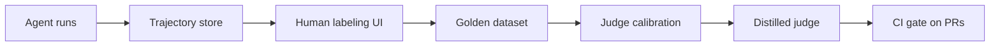

# AgentVerdict

**CI-native evaluation platform for tool-calling AI agents, with a human-calibrated judge.**

## Why

Most teams shipping AI agents have solid observability and almost no evaluation. Industry
surveys through 2025–26 put observability adoption near 90% of production LLM teams, while
barely half run any offline evals at all. Traces tell you *what* your agent did; nothing tells
you whether it was *good*.

The default answer is LLM-as-judge: point a frontier model at your agent's transcripts and ask
it to grade them. The problem is that the judge itself is almost never measured. A judge that
disagrees with your own engineers 30% of the time, prefers verbose answers, or favors outputs
from its own model family will happily wave regressions through — and you will not find out
until users do.

AgentVerdict treats the judge as an ML artifact in its own right:

- **Human-labeled golden datasets.** Recorded agent trajectories, labeled pass/fail/borderline
  by people, stored as the ground truth everything else is measured against.
- **Judge calibration.** Judge-vs-human agreement (Cohen's kappa) plus position, verbosity, and
  self-preference bias analysis, so you know exactly how much to trust a given judge.
- **A distilled local judge.** A small open model fine-tuned on accumulated judgments — cheap
  enough to run on every pull request, calibrated against the same golden set.
- **A CI gate.** A GitHub Action that runs cost-bounded eval suites and blocks merges only on
  statistically significant regressions (bootstrapped confidence intervals, not vibes).

## How it works



Agent runs are captured as step-by-step trajectories. Humans label them in a browser to build a
golden dataset. LLM judges are calibrated against those labels, a small local judge is distilled
from the accumulated judgments, and the calibrated judge gates pull requests in CI.

## Current status

**Milestone 1 — golden-dataset workbench** and **Milestone 2 — eval runner** are done, and
**Milestone 3 part 1 — judge calibration** has landed. What works today:

- Trajectory store: tasks, multi-step trajectories, and human labels in SQLite or Postgres
- JSONL import/export of trajectory bundles, with realistic sample data in `examples/`
- Browser labeling UI: queue → trajectory view → submit verdict → next unlabeled
- LLM-as-judge scoring via Groq: strict-JSON `pass|fail|borderline` verdicts with a rationale
  and rubric scores, persisted per trajectory and shown beneath the human label form
- Replay harness: a tool-calling reference agent works through stored tasks against
  fixture-driven mock tools and records each attempt as a fresh trajectory — no live systems
  to stub, no randomness, so a replay is reproducible
- End-to-end `agentverdict eval`: replay a slice of the task set, judge exactly the runs it
  just produced, and print one combined summary
- Judge calibration: Cohen's kappa against the human labels, an ordinal weighted kappa, a
  bootstrap confidence interval, the confusion matrix, the inter-annotator human ceiling, and a
  ranked drill-down of every disagreement — on the CLI, over the API, and as a `/calibration`
  page in the browser
- CLI: `init-db`, `import`, `export`, `stats`, `serve`, `judge`, `replay`, `eval`, `calibrate`
- REST API under `/api`, test suite, CI workflow, docker-compose for Postgres

The human-labeled dataset stays the ground truth throughout: the judge is scored against it,
never the other way round. Bias analysis (position, verbosity, self-preference), the distilled
local judge, and the CI gate are later milestones; see [ROADMAP.md](ROADMAP.md).

## Quickstart

Requires Python 3.11+. With conda (any virtualenv tool works the same way):

```bash
conda create -n agentverdict python=3.12
conda activate agentverdict
pip install -e ".[dev]"

agentverdict init-db
agentverdict import examples/sample_trajectories.jsonl
agentverdict serve
```

Then open <http://127.0.0.1:8000/label> to start labeling. `agentverdict stats` prints task,
trajectory, and label counts plus the verdict histogram; `agentverdict export out.jsonl` writes
the dataset back out as a JSONL bundle.

By default everything runs against a local SQLite file (`agentverdict.db`), so there is nothing
else to set up.

### Tests and lint

```bash
pytest
ruff check src tests
```

The test suite runs on in-memory SQLite — no network, no Docker required.

### Postgres (prod-like)

```bash
cp .env.example .env   # points AGENTVERDICT_DATABASE_URL at the compose Postgres
docker compose up -d db
agentverdict init-db
agentverdict serve
```

All configuration comes from `AGENTVERDICT_*` environment variables (or `.env`);
`AGENTVERDICT_DATABASE_URL` selects the database.

### Database migrations

Schema changes ship as Alembic revisions inside the package
(`src/agentverdict/migrations`), and `agentverdict init-db` applies them. It is the one
command to run against a fresh or an existing database, on SQLite and Postgres alike. New
revisions are written from the repo root:

```bash
alembic revision --autogenerate -m "add a column"
```

`alembic.ini` deliberately carries no database URL: the migration environment reads
`AGENTVERDICT_DATABASE_URL` like everything else, so the CLI and manual `alembic` commands
always target the same database.

A database created before migrations existed has the tables but no revision stamp, so a plain
upgrade would try to create tables that are already there. `init-db` handles that case itself:
an untracked database is stamped at the baseline revision and then upgraded forward, so
existing data survives and the columns added since arrive as ordinary migrations. There is
nothing manual to run.

## Running an evaluation

Replay and judging are the only parts that call out to a model, so they need a Groq API key.
A `.env` file in the working directory is read automatically, which is the least annoying
option:

```
GROQ_API_KEY=gsk_...
```

Or set it in the shell for the session — bash/zsh:

```bash
export GROQ_API_KEY="gsk_..."
```

PowerShell:

```powershell
$env:GROQ_API_KEY = "gsk_..."
```

`AGENTVERDICT_GROQ_API_KEY` works too and wins if both are set. Then register a judge, replay a
couple of tasks, and score the result:

```bash
agentverdict judge add groq-70b
agentverdict replay --limit 2
agentverdict eval --judge groq-70b --limit 2
```

`judge add` records a judge — a name, a model id (defaulting to `AGENTVERDICT_JUDGE_MODEL`), and
its prompting config — so every verdict can be traced back to the exact recipe that produced it.

`replay` runs the agent under test against stored tasks and saves each attempt as a new
trajectory with `source="replay"`, printing one line per task. Narrow the sweep with
`--task-key`, cap it with `--limit`, sample the same task several times with `--repeats`, pick
the agent under test with `--adapter`, and override its model with `--model`. A task that blows
up is reported and skipped; the rest of the sweep still runs.

`eval` is the end-to-end suite: it replays, then judges *exactly* the trajectories it just
created, and prints a combined summary. Pass `--skip-replay` to judge trajectories already in
the store instead — that is how you score the judge against the labeled golden set.

The summary tells you how many trajectories were replayed and judged, the verdict histogram
(`pass` / `fail` / `borderline`), how many judge calls errored, and the input/output token
totals for the run. Errors are counted rather than fatal: a malformed judge response or a
failed API call is stored on the verdict row and the run continues. When the judged
trajectories already carry human labels, the summary also prints a naive human-agreement
figure — judge verdict versus the majority human verdict. Freshly replayed runs are unlabeled,
so that line only appears on `--skip-replay` runs over the golden set. It is a rough sanity
check, not a measurement: the real agreement statistics come from the calibration report below.

### Why tasks carry a separate user message

A task's `prompt` is written for graders: it describes the scenario *and* states what a good
agent should do, which is exactly what the expected outcome and the judge need. Sending that
text to the agent under test would hand it the answer, and every replay would look brilliant.
Tasks therefore also carry `user_message`, the first-person opening line a real customer would
type ("Hi, my order NW-1001 never arrived"). Replay sends that; the grader-facing prompt never
reaches the agent. Tasks without a `user_message` fall back to the prompt, which is fine for
imported historical data but not what you want for a task you intend to replay.

### Mock tools

The agent's tools are backed by a fixture file, `examples/mock_tools.json`, rather than live
systems:

```json
{"tools": {"lookup_order": {
   "rules": [{"when": {"order_id": "NW-1001"},
              "result": {"status": "delivered"}, "is_error": false}],
   "default": {"result": {"error": "Order not found"}, "is_error": true}}}}
```

The first rule whose `when` entries all match the call's arguments (compared as trimmed strings)
wins; otherwise the tool's `default` is returned; otherwise a generic error naming the unknown
tool. Matching is deterministic — no randomness anywhere — so the same task and the same model
output always produce the same tool results, and a replay can be reproduced.

This is the point of the fixture format: adding a scenario means adding data, not code. Write
the task (its `key`, grader prompt, `user_message`, `tools_spec`, and expected outcome), add any
new tool responses to the fixture file, and it is replayable and gradable immediately.

## Calibrating the judge

An uncalibrated judge is not a measurement, it is a number that looks like one. A judge that
quietly disagrees with your own engineers a third of the time still returns confident `pass`
verdicts, the summary still looks healthy, and the regression it waved through surfaces when a
user hits it rather than when CI runs. Calibration puts a figure on that risk before the judge
is trusted with anything.

Three steps, and only the middle one costs money:

1. **Label trajectories by hand.** `agentverdict serve`, then work the queue at
   <http://127.0.0.1:8000/label>. A few dozen labeled runs is enough to start.
2. **Judge the same trajectories.** `agentverdict eval --judge groq-70b --skip-replay` scores
   what is already in the store instead of replaying fresh, unlabeled runs.
3. **Compare the two.** `agentverdict calibrate groq-70b`

Calibration never calls a model. It is pure analysis over verdicts already stored, so it needs
no API key, costs nothing, and is safe to run in CI. Each trajectory contributes one pair: the
majority human verdict against that judge's most recent verdict for it. Judge calls that errored
are excluded and counted separately, as are trajectories whose annotators split evenly — neither
has a ground truth to compare against, and both are reported rather than silently dropped.

What the report gives you:

- **Cohen's kappa** — the headline. Raw agreement flatters a judge on a skewed set: if 80% of
  your golden set passes, a judge that answers `pass` every single time agrees 80% of the time
  while knowing nothing. Kappa subtracts the agreement you would expect from chance given how
  often each rater reaches for each verdict, so 0.0 is "no better than guessing" and 1.0 is
  perfect. It is printed with the conventional Landis & Koch band — fair, moderate,
  substantial — so it can be read without living in kappa.
- **Ordinal weighted kappa** — verdicts are ordered, `fail < borderline < pass`, and the
  mistakes are not equally bad. Calling a human `pass` a `fail` is an inversion; calling it
  `borderline` is a hesitation. Plain kappa scores both as simply wrong, so a linear weighted
  kappa is reported beside it, penalising each disagreement by how far apart the two verdicts
  sit. Weighted much higher than plain means the judge is hedging, not inverting — a different
  problem with a different fix.
- **Bootstrap confidence interval** — golden sets start small, and kappa over 30 items is a
  noisy estimate. The interval resamples the trajectories with replacement, recomputes kappa on
  each resample, and reports the middle 95%. A kappa of 0.61 spanning [0.32, 0.83] is not
  evidence the judge is good; it is evidence you need more labels. The resampling is seeded, so
  the same rows always yield the same interval.
- **Confusion matrix and per-verdict precision/recall** — where the disagreement actually lives.
  It is usually one cell: the judge issuing `pass` where humans said `borderline`.
- **Disagreement drill-down** — every mismatched trajectory, worst first by ordinal distance
  (`pass` vs `fail` ahead of `pass` vs `borderline`), each carrying the judge's own rationale.
  This is the part you act on: read why it went wrong, then either fix the judge prompt or admit
  the rubric was ambiguous.

### What to compare the judge against

A kappa of 0.68 against humans reads as mediocre until you know what the humans score. The
report therefore also measures the annotators themselves, two ways — and the distinction
between them matters more than it looks.

The judge is scored against the **majority** verdict, and aggregating several annotators cancels
out individual noise. Comparing that to raw annotator-vs-annotator agreement is comparing a
de-noised reference to a noisy one, which flatters the judge: in simulation, a judge with
exactly the same error rate as each annotator scores 0.72 against the majority while the
annotators only reach 0.61 against each other. Read naively, an average judge looks superhuman.

So the report leads with **each annotator held out and scored against the majority of the
others** — the same treatment the judge gets, and the number to put beside the judge's. In the
same simulation that baseline is 0.78, correctly placing the judge just below human parity.
Pairwise annotator agreement is still shown underneath, because it is the right tool for a
different job: spotting one grader who reads the rubric differently from everyone else.

With exactly two annotators the two figures coincide, since the majority of "everyone else" is
just the other person.

A low human baseline is the cheapest early warning that a rubric is underspecified: it means
your own definition of `pass` is not shared, and every number downstream inherits that noise.

Scope a report to one batch with `--eval-run` or to one slice of the task set with `--task-key`,
and pass `--json` to get the whole report as a single JSON object — what a CI job or a notebook
should read, instead of parsing the printed tables. The same figures live in the browser UI:
<http://127.0.0.1:8000/calibration> lists the judges with their kappa, and
`/calibration/{judge_id}` shows the matrix, the human ceiling, and the drill-down, with each
disagreement linking straight through to the trajectory.

Until trajectories carry both a human label and a judge verdict there is nothing to pair up and
every statistic is undefined. The report says so and names the two commands that fix it, rather
than rendering zeros that look like findings.

## Architecture

M1 is a deliberately small core — four tables and the tooling around them:

- **tasks** — scenarios the agent-under-test should perform: a unique `key`, the grader-facing
  prompt, the customer-facing `user_message` replay sends to the agent, the tool specs available
  to the agent, an optional expected outcome, and tags.
- **trajectories** — one recorded agent run on a task: agent config, source
  (`api|import|manual|replay|langfuse`), status (`completed|error|truncated`), timing, and
  metadata.
- **trajectory_steps** — the ordered entries within a run: user/assistant/system messages, tool
  calls, and tool results, each with typed JSON content.
- **human_labels** — one verdict (`pass|fail|borderline`) per (trajectory, annotator), with an
  optional rationale and rubric scores; re-submitting replaces the annotator's previous label.

Trajectories round-trip through a line-oriented JSONL bundle format (one trajectory per line,
task upserted by key), which is how datasets move between machines and into version control.
The FastAPI app serves the JSON API under `/api` and the server-rendered labeling UI at
`/label`.

The eval runner adds three tables on top of that core — **judges** (a named model plus its
prompting config), **eval_runs** (one batch of judging, with its aggregate counts and tokens),
and **judge_verdicts** (one decision, or one recorded failure, per trajectory per run; a judge
may score the same trajectory in several runs, which is what repeat sampling needs). Replay
lives beside it: an agent adapter is anything with a `name` and a `run(task)` that returns an
ordered step list, so adapters never touch the database and swapping the bundled Groq reference
agent for your own is a small class, not a fork.

The full spec — data model, JSONL format, HTTP and CLI contracts, and milestone scope — lives
in [DESIGN.md](DESIGN.md), which is the source of truth when code and docs disagree.

## License

[MIT](LICENSE)
