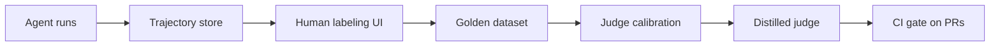

# AgentVerdict

**CI-native evaluation platform for tool-calling AI agents, with a human-calibrated judge.**


## Why

Most teams shipping AI agents have solid observability and almost no evaluation. Industry
surveys through 2025–26 put observability adoption near 90% of production LLM teams, while
barely half run any offline evals at all. Traces tell you *what* your agent did; nothing tells
you whether it was *good*.

The default answer is LLM-as-judge: point a frontier model at your agent's transcripts and ask
it to grade them. The problem is that the judge itself is almost never measured. A judge that
disagrees with your own engineers 30% of the time, prefers verbose answers, or favors outputs
from its own model family will happily wave regressions through — and you will not find out
until users do.

AgentVerdict treats the judge as an ML artifact in its own right:

- **Human-labeled golden datasets.** Recorded agent trajectories, labeled pass/fail/borderline
  by people, stored as the ground truth everything else is measured against.
- **Judge calibration.** Judge-vs-human agreement (Cohen's kappa) plus position, verbosity, and
  self-preference bias analysis, so you know exactly how much to trust a given judge.
- **A distilled local judge.** A small open model fine-tuned on accumulated judgments — cheap
  enough to run on every pull request, calibrated against the same golden set.
- **A CI gate.** A GitHub Action that runs cost-bounded eval suites and blocks merges only on
  statistically significant regressions (bootstrapped confidence intervals, not vibes).

## How it works



Agent runs are captured as step-by-step trajectories. Humans label them in a browser to build a
golden dataset. LLM judges are calibrated against those labels, a small local judge is distilled
from the accumulated judgments, and the calibrated judge gates pull requests in CI.

## Current status

**Milestone 1 — golden-dataset workbench**, **Milestone 2 — eval runner**, and
**Milestone 3 — the calibration lab** are done, and **Milestone 5 part 1 — the
regression gate** turns those calibrated verdicts into a merge decision. What works today:

- Trajectory store: tasks, multi-step trajectories, and human labels in SQLite or Postgres
- JSONL import/export of trajectory bundles, with realistic sample data in `examples/`
- Browser labeling UI: queue → trajectory view → submit verdict → next unlabeled
- LLM-as-judge scoring via Groq: strict-JSON `pass|fail|borderline` verdicts with a rationale
  and rubric scores, persisted per trajectory and shown beneath the human label form
- Replay harness: a tool-calling reference agent works through stored tasks against
  fixture-driven mock tools and records each attempt as a fresh trajectory — no live systems
  to stub, no randomness, so a replay is reproducible
- End-to-end `agentverdict eval`: replay a slice of the task set, judge exactly the runs it
  just produced, and print one combined summary
- Judge calibration: Cohen's kappa against the human labels, an ordinal weighted kappa, a
  bootstrap confidence interval, the confusion matrix, the inter-annotator human ceiling, a
  per-annotator comparison that puts judge and humans on identical items, and a ranked
  drill-down of every disagreement — on the CLI, over the API, and as a `/calibration` page in
  the browser
- Bias probes: `agentverdict probe` measures the judge's order sensitivity (permuted prompt
  sections, content byte-identical) and length sensitivity (an append-only padding ladder)
  against the judge's own test-retest noise floor, with stated statistical power on every arm —
  an underpowered result prints as "this instrument cannot see an effect this small", never as
  "unbiased"
- Per-criterion scoring: judge and annotators answer the same five structured questions
  alongside the verdict, so a disagreement can be attributed — *they read the run differently*
  (judge work) versus *they read it identically and the rules mapped it differently* (rubric
  work) — with a third bucket for splits whose criterion overlap is too thin to attribute
- Rubric versioning: labels record the rulebook they were made under, every eval run records
  the judge-prompt fingerprint that graded it, and a report that spans two rulebooks warns
  before its first statistic instead of averaging across them
- Regression gate: `agentverdict compare` scores two eval runs, pairs them task by task,
  bootstraps the per-task deltas, and answers `regression` / `improvement` / `inconclusive` —
  blocking a merge only when the whole confidence interval sits below zero, on the CLI, over the
  API, and from a pull-request workflow that posts the summary
- CLI: `init-db`, `import`, `export`, `stats`, `serve`, `judge`, `replay`, `eval`, `calibrate`,
  `probe`, `compare`
- REST API under `/api`, test suite, CI workflow, docker-compose for Postgres

The human-labeled dataset stays the ground truth throughout: the judge is scored against it,
never the other way round, and the gate is only allowed to block on what that judge has been
shown to measure. Self-preference analysis (which needs a correct difference-in-differences
estimator and at least two judge families crossed over two agent families — the naive version
measures leniency), the distilled local judge, and cost-bounded suites are later milestones;
see [ROADMAP.md](ROADMAP.md).

## Quickstart

Requires Python 3.11+. With conda (any virtualenv tool works the same way):

```bash
conda create -n agentverdict python=3.12
conda activate agentverdict
pip install -e ".[dev]"

agentverdict init-db
agentverdict import examples/sample_trajectories.jsonl
agentverdict serve
```

Then open <http://127.0.0.1:8000/label> to start labeling. `agentverdict stats` prints task,
trajectory, and label counts plus the verdict histogram; `agentverdict export out.jsonl` writes
the dataset back out as a JSONL bundle.

By default everything runs against a local SQLite file (`agentverdict.db`), so there is nothing
else to set up.

### Tests and lint

```bash
pytest
ruff check src tests
```

The test suite runs on in-memory SQLite — no network, no Docker required.

### Postgres (prod-like)

```bash
cp .env.example .env   # points AGENTVERDICT_DATABASE_URL at the compose Postgres
docker compose up -d db
agentverdict init-db
agentverdict serve
```

All configuration comes from `AGENTVERDICT_*` environment variables (or `.env`);
`AGENTVERDICT_DATABASE_URL` selects the database.

### Database migrations

Schema changes ship as Alembic revisions inside the package
(`src/agentverdict/migrations`), and `agentverdict init-db` applies them. It is the one
command to run against a fresh or an existing database, on SQLite and Postgres alike. New
revisions are written from the repo root:

```bash
alembic revision --autogenerate -m "add a column"
```

`alembic.ini` deliberately carries no database URL: the migration environment reads
`AGENTVERDICT_DATABASE_URL` like everything else, so the CLI and manual `alembic` commands
always target the same database.

A database created before migrations existed has the tables but no revision stamp, so a plain
upgrade would try to create tables that are already there. `init-db` handles that case itself:
an untracked database is stamped at the baseline revision and then upgraded forward, so
existing data survives and the columns added since arrive as ordinary migrations. There is
nothing manual to run.

## Running an evaluation

Replay and judging are the only parts that call out to a model, so they need a Groq API key.
A `.env` file in the working directory is read automatically, which is the least annoying
option:

```
GROQ_API_KEY=gsk_...
```

Or set it in the shell for the session — bash/zsh:

```bash
export GROQ_API_KEY="gsk_..."
```

PowerShell:

```powershell
$env:GROQ_API_KEY = "gsk_..."
```

`AGENTVERDICT_GROQ_API_KEY` works too and wins if both are set. Then register a judge, replay a
couple of tasks, and score the result:

```bash
agentverdict judge add groq-70b
agentverdict replay --limit 2
agentverdict eval --judge groq-70b --limit 2
```

`judge add` records a judge — a name, a model id (defaulting to `AGENTVERDICT_JUDGE_MODEL`), and
its prompting config — so every verdict can be traced back to the exact recipe that produced it.

`replay` runs the agent under test against stored tasks and saves each attempt as a new
trajectory with `source="replay"`, printing one line per task. Narrow the sweep with
`--task-key`, cap it with `--limit`, sample the same task several times with `--repeats`, pick
the agent under test with `--adapter`, and override its model with `--model`. A task that blows
up is reported and skipped; the rest of the sweep still runs.

`eval` is the end-to-end suite: it replays, then judges *exactly* the trajectories it just
created, and prints a combined summary. Pass `--skip-replay` to judge trajectories already in
the store instead — that is how you score the judge against the labeled golden set.

The summary tells you how many trajectories were replayed and judged, the verdict histogram
(`pass` / `fail` / `borderline`), how many judge calls errored, and the input/output token
totals for the run. Errors are counted rather than fatal: a malformed judge response or a
failed API call is stored on the verdict row and the run continues. When the judged
trajectories already carry human labels, the summary also prints a naive human-agreement
figure — judge verdict versus the majority human verdict. Freshly replayed runs are unlabeled,
so that line only appears on `--skip-replay` runs over the golden set. It is a rough sanity
check, not a measurement: the real agreement statistics come from the calibration report below.

### Why tasks carry a separate user message

A task's `prompt` is written for graders: it describes the scenario *and* states what a good
agent should do, which is exactly what the expected outcome and the judge need. Sending that
text to the agent under test would hand it the answer, and every replay would look brilliant.
Tasks therefore also carry `user_message`, the first-person opening line a real customer would
type ("Hi, my order NW-1001 never arrived"). Replay sends that; the grader-facing prompt never
reaches the agent. Tasks without a `user_message` fall back to the prompt, which is fine for
imported historical data but not what you want for a task you intend to replay.

### Mock tools

The agent's tools are backed by a fixture file, `examples/mock_tools.json`, rather than live
systems:

```json
{"tools": {"lookup_order": {
   "rules": [{"when": {"order_id": "NW-1001"},
              "result": {"status": "delivered"}, "is_error": false}],
   "default": {"result": {"error": "Order not found"}, "is_error": true}}}}
```

The first rule whose `when` entries all match the call's arguments (compared as trimmed strings)
wins; otherwise the tool's `default` is returned; otherwise a generic error naming the unknown
tool. Matching is deterministic — no randomness anywhere — so the same task and the same model
output always produce the same tool results, and a replay can be reproduced.

This is the point of the fixture format: adding a scenario means adding data, not code. Write
the task (its `key`, grader prompt, `user_message`, `tools_spec`, and expected outcome), add any
new tool responses to the fixture file, and it is replayable and gradable immediately.

## Calibrating the judge

An uncalibrated judge is not a measurement, it is a number that looks like one. A judge that
quietly disagrees with your own engineers a third of the time still returns confident `pass`
verdicts, the summary still looks healthy, and the regression it waved through surfaces when a
user hits it rather than when CI runs. Calibration puts a figure on that risk before the judge
is trusted with anything.

Three steps, and only the middle one costs money:

1. **Label trajectories by hand.** `agentverdict serve`, then work the queue at
   <http://127.0.0.1:8000/label>. A few dozen labeled runs is enough to start.

   
2. **Judge the same trajectories.** `agentverdict eval --judge groq-70b --skip-replay` scores
   what is already in the store instead of replaying fresh, unlabeled runs.
3. **Compare the two.** `agentverdict calibrate groq-70b`

Calibration never calls a model. It is pure analysis over verdicts already stored, so it needs
no API key, costs nothing, and is safe to run in CI. Each trajectory contributes one pair: the
majority human verdict against that judge's most recent verdict for it. Judge calls that errored
are excluded and counted separately, as are trajectories whose annotators split evenly — neither
has a ground truth to compare against, and both are reported rather than silently dropped.

What the report gives you:

- **Cohen's kappa** — the headline. Raw agreement flatters a judge on a skewed set: if 80% of
  your golden set passes, a judge that answers `pass` every single time agrees 80% of the time
  while knowing nothing. Kappa subtracts the agreement you would expect from chance given how
  often each rater reaches for each verdict, so 0.0 is "no better than guessing" and 1.0 is
  perfect. It is printed with the conventional Landis & Koch band — fair, moderate,
  substantial — so it can be read without living in kappa.
- **Ordinal weighted kappa** — verdicts are ordered, `fail < borderline < pass`, and the
  mistakes are not equally bad. Calling a human `pass` a `fail` is an inversion; calling it
  `borderline` is a hesitation. Plain kappa scores both as simply wrong, so a linear weighted
  kappa is reported beside it, penalising each disagreement by how far apart the two verdicts
  sit. Weighted much higher than plain means the judge is hedging, not inverting — a different
  problem with a different fix.
- **Bootstrap confidence interval** — golden sets start small, and kappa over 30 items is a
  noisy estimate. The interval resamples the trajectories with replacement, recomputes kappa on
  each resample, and reports the middle 95%. A kappa of 0.61 spanning [0.32, 0.83] is not
  evidence the judge is good; it is evidence you need more labels. The resampling is seeded, so
  the same rows always yield the same interval.
- **Confusion matrix and per-verdict precision/recall** — where the disagreement actually lives.
  It is usually one cell: the judge issuing `pass` where humans said `borderline`.
- **Disagreement drill-down** — every mismatched trajectory, worst first by ordinal distance
  (`pass` vs `fail` ahead of `pass` vs `borderline`), each carrying the judge's own rationale.
  This is the part you act on: read why it went wrong, then either fix the judge prompt or admit
  the rubric was ambiguous.

### What to compare the judge against

A kappa of 0.68 against humans reads as mediocre until you know what the humans score. The
report therefore also measures the annotators themselves, two ways — and the distinction
between them matters more than it looks.

The judge is scored against the **majority** verdict, and aggregating several annotators cancels
out individual noise. Comparing that to raw annotator-vs-annotator agreement is comparing a
de-noised reference to a noisy one, which flatters the judge: in simulation, a judge with
exactly the same error rate as each annotator scores 0.72 against the majority while the
annotators only reach 0.61 against each other. Read naively, an average judge looks superhuman.

So the report leads with **each annotator held out and scored against the majority of the
others** — the same treatment the judge gets, and the number to put beside the judge's. In the
same simulation that baseline is 0.78, correctly placing the judge just below human parity.
Pairwise annotator agreement is still shown underneath, because it is the right tool for a
different job: spotting one grader who reads the rubric differently from everyone else.

With exactly two annotators the two figures coincide, since the majority of "everyone else" is
just the other person.

A low human baseline is the cheapest early warning that a rubric is underspecified: it means
your own definition of `pass` is not shared, and every number downstream inherits that noise.

### Judge against each annotator, on the same items

The headline kappa is measured against the human **majority**, and a trajectory whose annotators
tie has no majority, so it is dropped from the comparison. With two annotators every
disagreement is a tie — which means the judge is scored only on the trajectories the humans
already agreed about, the easy ones, while the human figures beside it are computed over
everything the judge scored, hard cases included. Two numbers over two different samples, printed
side by side as if they were commensurable.

This is not hypothetical; it happened on this project's own dataset. The report showed a judge
kappa of **0.786** against a human "ceiling" of **0.523**, which reads as a judge comfortably
outscoring the annotators it is supposed to imitate. Recomputed on the identical 13 trajectories,
the picture inverts:

- vamp vs momo — kappa 0.523
- vamp vs judge — kappa 0.337
- momo vs judge — kappa 0.764

The judge agrees with one of its two annotators *less* than the annotators agree with each other.
The 0.786 was not a better judge, it was an easier sample.

So the report also scores the judge against **each annotator individually, on exactly the
trajectories both of them rated** — ties included, nothing dropped for want of a majority. Those
rows carry the same `n` as the pairwise human rows beside them, so judge-vs-human and
human-vs-human can be read against each other directly instead of hoping the two samples happen
to match. The headline kappa stays where it is, because the aggregated majority is still the
right ground truth to hold a judge to; it is just no longer the only number on the page, and no
longer the one that can quietly flatter.

### Scoping a report to one annotation round

`--annotator` restricts a report to a named set of raters. Repeat the flag once per name:

```bash
agentverdict calibrate groq-70b --annotator vamp-r2 --annotator momo-r2
```

Everything is then computed from those annotators' labels alone — the majority verdict the judge
is scored against, the ties, the human ceiling and baseline, and the per-annotator rows.

The reason it exists: when a disagreement turns out to be an ambiguous rubric rather than a
grading mistake, the fix is to write the rule down (the rubric rules in [DESIGN.md](DESIGN.md))
and label again. But a label is unique per (trajectory, annotator) and re-submitting replaces the
old one, so re-labeling under the same names would erase the evidence that the rubric was ever
ambiguous. The second round is therefore recorded under fresh names — `vamp-r2`, `momo-r2` — and
`--annotator` picks which round a report describes. Round 1 stays on disk as the honest
pre-clarification record, and the two rounds can be scored against each other rather than one
silently overwriting the other.

Scope a report to one batch with `--eval-run` or to one slice of the task set with `--task-key`;
all three filters compose, so one round on one task's trajectories is a single command. Pass
`--json` to get the whole report as a single JSON object — what a CI job or a notebook should
read, instead of parsing the printed tables. The same figures live in the browser UI:
<http://127.0.0.1:8000/calibration> lists the judges with their kappa, and
`/calibration/{judge_id}` shows the matrix, the human ceiling, and the drill-down, with each
disagreement linking straight through to the trajectory.

Until trajectories carry both a human label and a judge verdict there is nothing to pair up and
every statistic is undefined. The report says so and names the two commands that fix it, rather
than rendering zeros that look like findings.

### Judging on the written remark, not just the verdict

A verdict is one word, and one word cannot say *why* two raters disagreed. On a real run in this
repository's dataset, the judge's rationale agreed with both annotators about every fact — the
agent looked the order up, reported status and ETA exactly as asked — and the verdicts still
split, because the disagreement lived in the rule that turns a reading into a verdict, not in the
reading. Calibration recorded that as judge error. It was a rubric bug.

So the judge and the annotators answer the same five structured questions alongside the verdict
(goal achieved, tools correct, consent obtained, ended waiting on the customer, communication
clear), and `calibrate` reports agreement per criterion. Every disagreement then lands in one of
three buckets, printed above the drill-down:

- **rubric disagreements** — identical criterion answers, different verdicts. The rule is at
  fault; re-prompting a judge that already reads the runs as the annotators do moves nothing.
- **perception differences** — some criterion answered differently. The judge is misreading
  runs, and that is prompt/model work.
- **undetermined** — the criterion overlap is too thin to attribute either way. One unanswered
  criterion out of five can carry a verdict alone, so these are never counted as evidence
  against either side; the fix is more labeling.


Absence is never zero anywhere in this: `consent_obtained` is omitted — by the judge, the
labeling form, and the API alike — when a run took no irreversible action, because 0.0 *means*
"acted without agreement" and writing it for a read-only run would report a violation that never
happened. A criterion answered by only one side is excluded from agreement and counted, never
coerced.

Every criterion is optional for annotators, and a bare verdict is still a complete label — the
first labeling round predates these questions and remains fully valid. Labels record which
rubric version was on screen; eval runs record the judge-prompt fingerprint that graded them; a
report that spans two rulebooks says so before its first statistic, because an average across
two rulebooks describes no rulebook that ever existed.

## Probing the judge for bias

Agreement statistics cannot see a judge that reads position instead of content — it can hit a
respectable kappa while doing so. But the bias literature is written for **pairwise** judges
("here are answers A and B, which is better?"), where position bias is measured by swapping A
and B. This judge is a pointwise grader: one trajectory in, one verdict out. There is no A and
no B, so the probes are re-derived for what this judge actually is, and named for what they
actually measure:

```bash
agentverdict probe groq-70b --probe order   --repeats 3
agentverdict probe groq-70b --probe length  --repeats 3
```

**Order sensitivity** permutes the prompt's context sections while holding every byte of their
content fixed (the transcript itself is never reordered — reordering an agent's steps is a
different run, not the same run seen differently). **Length sensitivity** appends semantically
null filler to the agent's turns in escalating doses; perturbations may only ever add
characters, so content preservation holds by construction. A `terse` mirror arm was considered
and cut: on this corpus, truncating agent turns deletes the consent request or the closing
question in most labeled runs — precisely the facts the rubric turns on — so a judge that
downgrades the truncated run is judging *correctly*, and reporting that as bias would be the
exact error the probe exists to catch.

Every probe is measured against two controls: an identity arm re-judged verbatim (the judge's
own test-retest noise floor, reported as a headline figure in its own right) and a format-null
arm that is semantically identical but byte-different, separating raw prompt-format jitter from
real order effects. A delivery check on the rendered prompt's hash distinguishes three ways of
measuring nothing: `not_applied` (the perturbation never reached the judge — debug the
harness), `no_data` (it did, and every call answering it failed — read the error count), and
`inconclusive` (measured, nothing found). Only the last is evidence about the judge.

The headline statistic is the signed ordinal shift, not a flip rate — a flip rate responds to
the judge's *entropy*, and a perturbation that scatters answers symmetrically raises it without
moving the verdict distribution at all. And every arm prints its own statistical power: with a
percentile bootstrap over n items, no interval can exclude zero until four items move —
essentially independent of n, since the resample's atom at zero tends to e^−k. So each arm
reports movers observed against movers required, and an underpowered arm says plainly that the
instrument cannot see an effect this small, which is not the same claim as "unbiased" and is
never printed as if it were.

Probe verdicts live in their own tables and never touch `judge_verdicts` — a verdict on a
deliberately corrupted transcript is not a verdict on the run, and calibration and the merge
gate must never ingest one. The golden dataset's byte-identity across a probe run is pinned by
test.

## Gating a pull request

This is the command everything above builds towards. Someone opens a pull request that rewrites
an agent's prompt, swaps its model, or reorders a tool spec. CI replays the eval suite, judges
it, and compares the result against a stored baseline run:

```bash
agentverdict compare BASE CANDIDATE --fail-on-regression
```

`BASE` and `CANDIDATE` are eval-run ids — the baseline you keep for `main`, and the run CI just
produced on the branch. The command exits 1 only when the suite got *demonstrably* worse. A
change that lands within the noise exits 0 and the merge goes through. Without
`--fail-on-regression` it always exits 0 and only prints, which is what you want locally or in a
report-only job.

There is a third exit code, and the distinction matters more than it looks: **2 means the
comparison could not be made at all** — an id that does not resolve, two runs from different
judges, two runs graded by different versions of the judge prompt. A gate that collapsed that
into exit 1 would tell a contributor their change made the agent worse when nothing about their
change was ever measured. Automation should branch on all three.

Take the candidate id from `eval --run-id-file`, not from a query:

```bash
agentverdict eval --judge ci-gate --limit 6 --run-id-file candidate-run-id
agentverdict compare "$BASE" "$(cat candidate-run-id)" --fail-on-regression
```

The obvious alternative — ask the database for the newest run under this judge — is wrong on
exactly the setup this project recommends. Point two pull requests at one shared database and
each picks up whichever run finished last, so each gates the other branch. The file is cleared
before the eval starts and written only once a run exists, so an empty file means there is
nothing to compare rather than a stale id from yesterday.

Comparing calls no model and costs nothing: like calibration, it is arithmetic over verdicts
already in the database. Only the replay and judging steps ahead of it spend tokens.

### What gets compared

Two eval runs, paired **by task**.

Each verdict is worth `fail 0.0`, `borderline 0.5`, `pass 1.0` — linear on the ordinal scale, so
turning one pass into a fail costs exactly as much as turning two passes into borderlines. A
task's score is the mean over its trajectories in that run; the run's score is the mean over its
tasks. Two levels of averaging, for a reason: `--repeats 3` samples a flaky task three times
without handing it three votes in the total.

Pairing is by task and never by trajectory, because replay records fresh trajectories every
time — two runs share no trajectory ids at all, only task keys. Tasks that appear in only one of
the runs are excluded from the statistics and listed separately (`base_only_tasks`,
`candidate_only_tasks`). Quietly folding them in would let *adding a task* read as a quality
change, which is exactly the kind of defect that discredits a gate.

### Why a bootstrap instead of two numbers

Run the same suite twice, change nothing, and the score moves. The agent samples, the judge
hedges differently on transcripts that are genuinely contestable, and on a twelve-task suite a
single verdict sliding from `pass` to `borderline` is worth four points. "Baseline 0.83,
candidate 0.79, block the merge" is not a measurement — it is reading noise as signal, and it
will fire on pull requests that changed nothing that matters.

So the gate asks a different question: how much does this delta depend on *which tasks happen to
be in the suite*? It takes the per-task deltas, resamples those tasks with replacement ten
thousand times, recomputes the mean delta on each resample, and keeps the middle 95%. Then it
reads the interval, and only the interval:

| 95% interval on the mean delta | Outcome | Merge |
|---|---|---|
| entirely below zero | `regression` | blocked, exit 1 |
| entirely above zero | `improvement` | allowed |
| straddles zero, or too few tasks to resample | `inconclusive` | allowed |

Only `regression` sets `blocks_merge`. Everything else is reported and lets the merge through —
including the case where the mean visibly dropped but the interval still contains zero. That is
the gate saying "this suite cannot tell", which is the honest answer rather than a cautious one.
The resampling is seeded, so the same two runs always produce the same interval; a gate whose
verdict changes when you re-run it is not a gate. Ten thousand resamples rather than the
thousand used for reporting elsewhere, because this interval is not read, it is *thresholded* —
the merge turns on whether its upper edge sits below zero, and near that edge the resampling
noise in the edge is the entire decision. A fixed seed makes that noise reproducible without
making it smaller.

The permissive default is a design decision, not a shortcut. A gate that blocks on noise gets
switched off: the second time it stops a correct change for no reason, someone adds
`continue-on-error` or deletes the job, and from then on nothing is gating anything. A gate
nobody trusts is worse than no gate at all, because it also carries the appearance of one. The
cost of that choice is worth stating plainly — a small suite will not detect a small regression,
and the fix is more tasks (or more repeats), never a looser threshold.

### The gate is only as good as the judge behind it

A blocking verdict is a judge's opinion with statistics wrapped around it. If that judge
disagrees with your own engineers a third of the time, the interval is a precise summary of an
unreliable instrument: the gate will block good changes and wave bad ones through with identical
confidence. This is why calibration comes first in this project, and why a comparison records
the judge it used. Both runs must come from the same judge — compare two runs scored by
different judges and the delta measures the judges, not the agent.

The same applies to the *rubric*, and that one is easier to miss because the judge keeps its
name. Every eval run stores a fingerprint of the judge prompt it was graded with, and a
comparison across two fingerprints is refused. The pull request that edits `judging/prompts.py`
is precisely the pull request whose score movement is not about the agent: it re-grades every
transcript, and the result looks exactly like a quality change. The fingerprint is derived from
the prompt text rather than a version constant somebody has to remember to bump, because that
constant goes stale on the one commit where it mattered. When it fires, merge the rubric change
and record a fresh baseline under it — the gate cannot grade a change to itself.

Read the kappa before turning `--fail-on-regression` on. A judge that cannot match your
annotators has no business blocking their merges.

### In CI

The bundled workflow, `.github/workflows/eval-gate.yml`, runs the three steps on every pull
request: replay the suite and judge it, compare that run against the stored baseline, and post
the summary back to the pull request.

The job fails on two things, and its summary always says which. A red check is either a measured
regression — the suite got worse, not merely moved — or a gate that could not run at all, which
is a configuration problem the repository owner needs to see and which says nothing about the
change. The summary also distinguishes a green check that means "no blocking regression over six
shared tasks" from one that means "the baseline shared no task with this run, so nothing was
checked". That last case passes, because the usual cause is a suite that legitimately changed
shape, but it is stated rather than reported as a clean bill of health.

`--json` prints the whole comparison as a single object — outcome, interval, tokens spent, and
every per-task delta — which is what a bot comment, a dashboard, or a notebook should read
instead of parsing the printed table. The same figures are available over HTTP:

```bash
curl "http://127.0.0.1:8000/api/comparisons?base=BASE&candidate=CANDIDATE"
```

Keep the baseline deliberate: one eval run against `main`, its id recorded where the workflow can
read it, refreshed when you actually intend to move the bar. A baseline that drifts from run to
run turns the gate into a comparison between two arbitrary samples.

## Architecture

M1 is a deliberately small core — four tables and the tooling around them:

- **tasks** — scenarios the agent-under-test should perform: a unique `key`, the grader-facing
  prompt, the customer-facing `user_message` replay sends to the agent, the tool specs available
  to the agent, an optional expected outcome, and tags.
- **trajectories** — one recorded agent run on a task: agent config, source
  (`api|import|manual|replay|langfuse`), status (`completed|error|truncated`), timing, and
  metadata.
- **trajectory_steps** — the ordered entries within a run: user/assistant/system messages, tool
  calls, and tool results, each with typed JSON content.
- **human_labels** — one verdict (`pass|fail|borderline`) per (trajectory, annotator), with an
  optional rationale and rubric scores; re-submitting replaces the annotator's previous label.

Trajectories round-trip through a line-oriented JSONL bundle format (one trajectory per line,
task upserted by key), which is how datasets move between machines and into version control.
The FastAPI app serves the JSON API under `/api` and the server-rendered labeling UI at
`/label`.

The eval runner adds three tables on top of that core — **judges** (a named model plus its
prompting config), **eval_runs** (one batch of judging, with its aggregate counts and tokens),
and **judge_verdicts** (one decision, or one recorded failure, per trajectory per run; a judge
may score the same trajectory in several runs, which is what repeat sampling needs). Replay
lives beside it: an agent adapter is anything with a `name` and a `run(task)` that returns an
ordered step list, so adapters never touch the database and swapping the bundled Groq reference
agent for your own is a small class, not a fork.

The full spec — data model, JSONL format, HTTP and CLI contracts, and milestone scope — lives
in [DESIGN.md](DESIGN.md), which is the source of truth when code and docs disagree.

## License

[MIT](LICENSE)
