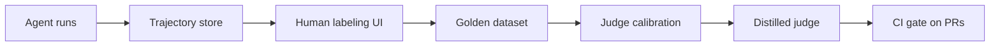

# AgentVerdict

**CI-native evaluation platform for tool-calling AI agents, with a human-calibrated judge.**

## Why

Most teams shipping AI agents have solid observability and almost no evaluation. Industry
surveys through 2025–26 put observability adoption near 90% of production LLM teams, while
barely half run any offline evals at all. Traces tell you *what* your agent did; nothing tells
you whether it was *good*.

The default answer is LLM-as-judge: point a frontier model at your agent's transcripts and ask
it to grade them. The problem is that the judge itself is almost never measured. A judge that
disagrees with your own engineers 30% of the time, prefers verbose answers, or favors outputs
from its own model family will happily wave regressions through — and you will not find out
until users do.

AgentVerdict treats the judge as an ML artifact in its own right:

- **Human-labeled golden datasets.** Recorded agent trajectories, labeled pass/fail/borderline
  by people, stored as the ground truth everything else is measured against.
- **Judge calibration.** Judge-vs-human agreement (Cohen's kappa) plus position, verbosity, and
  self-preference bias analysis, so you know exactly how much to trust a given judge.
- **A distilled local judge.** A small open model fine-tuned on accumulated judgments — cheap
  enough to run on every pull request, calibrated against the same golden set.
- **A CI gate.** A GitHub Action that runs cost-bounded eval suites and blocks merges only on
  statistically significant regressions (bootstrapped confidence intervals, not vibes).

## How it works



Agent runs are captured as step-by-step trajectories. Humans label them in a browser to build a
golden dataset. LLM judges are calibrated against those labels, a small local judge is distilled
from the accumulated judgments, and the calibrated judge gates pull requests in CI.

## Current status

**Milestone 1 — golden-dataset workbench** (in progress). What works today:

- Trajectory store: tasks, multi-step trajectories, and human labels in SQLite or Postgres
- JSONL import/export of trajectory bundles, with realistic sample data in `examples/`
- Browser labeling UI: queue → trajectory view → submit verdict → next unlabeled
- CLI: `init-db`, `import`, `export`, `stats`, `serve`
- REST API under `/api`, test suite, CI workflow, docker-compose for Postgres

No LLM calls happen anywhere in M1 — this milestone is entirely about building trustworthy
ground truth. Eval running, judge calibration, distillation, and the CI gate are later
milestones; see [ROADMAP.md](ROADMAP.md).

## Quickstart

Requires Python 3.11+. With conda (any virtualenv tool works the same way):

```bash
conda create -n agentverdict python=3.12
conda activate agentverdict
pip install -e ".[dev]"

agentverdict init-db
agentverdict import examples/sample_trajectories.jsonl
agentverdict serve
```

Then open <http://127.0.0.1:8000/label> to start labeling. `agentverdict stats` prints task,
trajectory, and label counts plus the verdict histogram; `agentverdict export out.jsonl` writes
the dataset back out as a JSONL bundle.

By default everything runs against a local SQLite file (`agentverdict.db`), so there is nothing
else to set up.

### Tests and lint

```bash
pytest
ruff check src tests
```

The test suite runs on in-memory SQLite — no network, no Docker required.

### Postgres (prod-like)

```bash
cp .env.example .env   # points AGENTVERDICT_DATABASE_URL at the compose Postgres
docker compose up -d db
agentverdict init-db
agentverdict serve
```

All configuration comes from `AGENTVERDICT_*` environment variables (or `.env`);
`AGENTVERDICT_DATABASE_URL` selects the database.

## Architecture

M1 is a deliberately small core — four tables and the tooling around them:

- **tasks** — scenarios the agent-under-test should perform: a unique `key`, the prompt, the
  tool specs available to the agent, an optional expected outcome, and tags.
- **trajectories** — one recorded agent run on a task: agent config, source
  (`api|import|manual|langfuse`), status (`completed|error|truncated`), timing, and metadata.
- **trajectory_steps** — the ordered entries within a run: user/assistant/system messages, tool
  calls, and tool results, each with typed JSON content.
- **human_labels** — one verdict (`pass|fail|borderline`) per (trajectory, annotator), with an
  optional rationale and rubric scores; re-submitting replaces the annotator's previous label.

Trajectories round-trip through a line-oriented JSONL bundle format (one trajectory per line,
task upserted by key), which is how datasets move between machines and into version control.
The FastAPI app serves the JSON API under `/api` and the server-rendered labeling UI at
`/label`.

The full spec — data model, JSONL format, HTTP and CLI contracts, and milestone scope — lives
in [DESIGN.md](DESIGN.md), which is the source of truth when code and docs disagree.

## License

[MIT](LICENSE)
